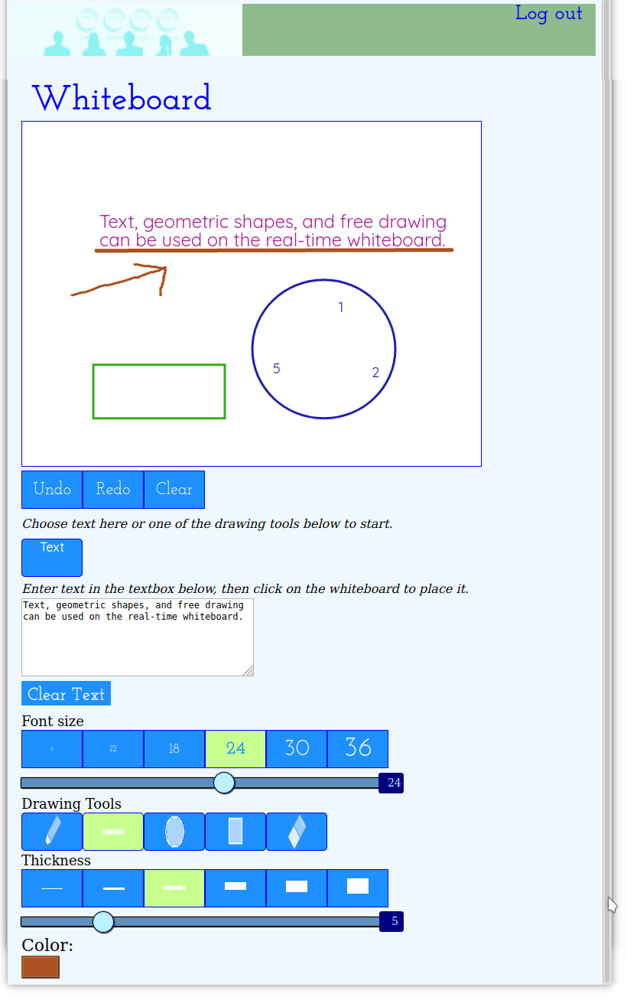

# Meeting Scheduler

Use a real-time online whiteboard with text, geometric shapes, and undo in your browser on desktop, tablet, or smartphone.

* Text wraps automatically on the canvas.
* Choose from multiple sizes for lines, geometric shapes, and text. 
* Choose any color for drawn objects and text.
* Multiple undo and eraser tool.

This project uses React, Javascript, NodeJS, Express, Socket.io, Canvas, Flexbox, Webpack, and Styled-components.

# Installation
* The included index.js sets up an Express server.  
* Select a port to be used for the express and socket.io servers(3000 by default).
* Put the port number and domain name or IP you wish to use in server/config.js 
* Install nodeJS.
* Run "npm install" to install all needed nodejs packages.
* Run "npm start" to start the Express server.
* Open two or more browsers on computers, tablets, or phones, connect to the server's IP address or domain and port number, and use the whiteboard together. 

